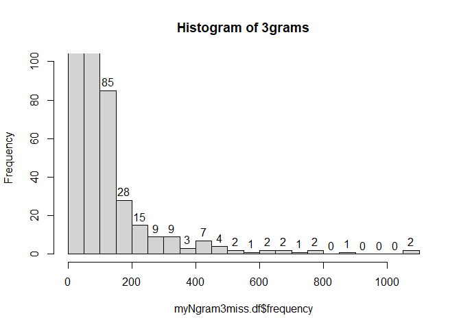
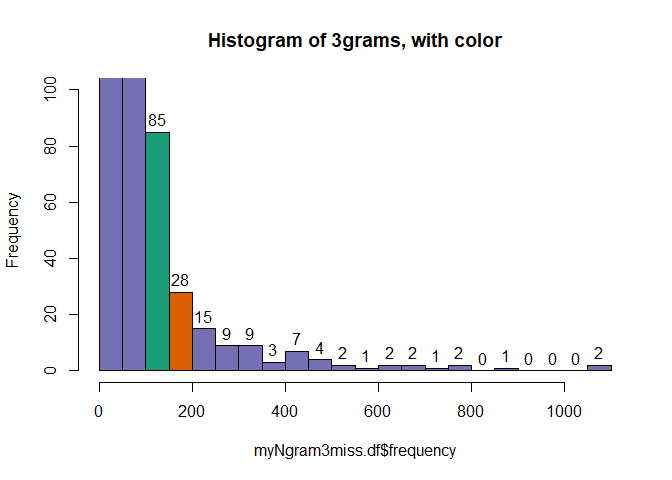
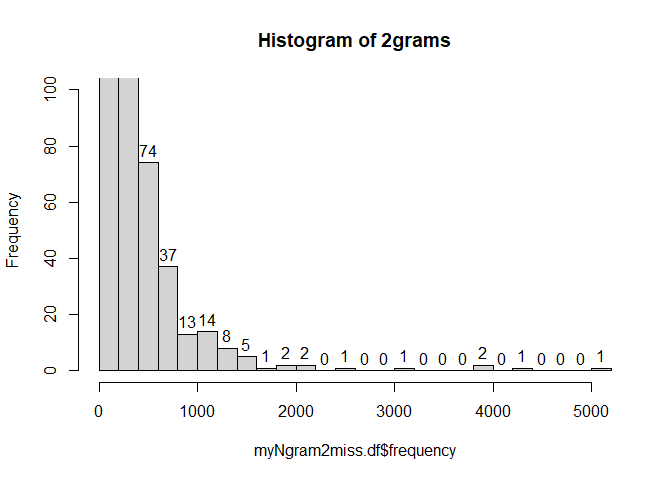
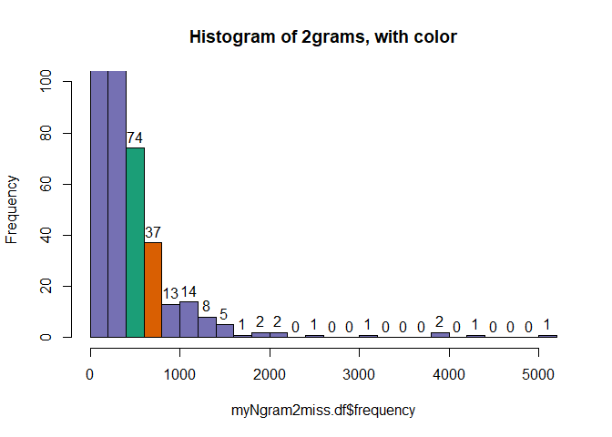

In this tutorial document, we will review the first step data preprocessing and creating document-frequency matrices (DFM or dfm) for our analysis of nonprofit mission statements.

*Additional information on replication steps and data for this project can be found [on this GitHub page](https://fjsantam.github.io/bespoke-npo-taxonomies/)*


# Introduction 

This tutorial uses the complete 2018 and 2019 approved 1023-EZ filings shared by the IRS, [located here](https://www.irs.gov/charities-non-profits/exempt-organizations-form-1023ez-approvals). The 2018 and 2019 files contain information such as mission statements and NTEE codes. The cleaned versions of the files, which we will be importing, have an additional column (Nteebasic) that just reports the first letter of the three-digit NTEE code, as well as have had applications with no mission statements (a blank value in that field) removed.

The 2018 and 2019 files are used because those are the first years in which the IRS began collecting mission statements as part of the 1023-EZ forms. For a comparison crosswalk, please refer to the relevant file [here](https://fjsantam.github.io/bespoke-npo-taxonomies/data/step-01-raw-data)


## Basic Cleaning

The datasets used in this tutorial have had some basic preprocessing steps completed in Excel before being imported:

1. removed observations with no mission statements
2. added a new column, "Nteebasic"
3. added new column, "Year"
4. capitalized "EIN" across 2018 and 2019 column names

Each of the above steps can be done in R, in Excel, etc., whichever you prefer. Explanations for each step follow. 

1\. We will need to clean some data because not all of the 1023-EZs in our dataset contain mission statements, as evidenced in the table below:

| Year | Type of Dataset | Number of Observed Filings |
| ---- | ----------------|--------------------------- |
| 2018 | Complete source data | 54,773 |
| 2018 | Filings with blank missions | 4,861 |
| 2018 | Filings with filled missions  | 49,912 |
| 2019 | Complete source data | 56,146 |
| 2019 | Filings with blank missions | 2 |
| 2019 | Filings with filled missions  | 56,144 |

Removing observations with no mission statements resolves one issue of missing data.

2\. Column "Nteebasic" Only reports the first letter from the 3-character "Nteecode" field, reducing the full NTEE value to its 26-letter major group. 

3\. Column "Year" contains the year of the approved filings.

4\. Standardizing "Ein" to "EIN" across files will ensure appropriate merging of different datasets.


# Creating the source dataset

## Preprocessing data on organization name and mission statement

To ensure that we encounter no issues later on, it is helpful to load all necessary packages at the top of the tutorial. We will also be loading them again in the relevant code chunks, as a an extra measure. 

* We will use the package `quanteda` to clean and analyze the data. 
* `quanteda.textstats` is a separate-but-related package that provides additional tools for use with `quanteda`-derived objects.
* The package `corpus` provides some additional text mining tools that are more customizable than what is offered in `quanteda`.
* The package `glue` is used in text cleaning.
* The package `scales` is used to generate clean presentations of numbers.


```{.r .fold-show}
#Core packages
library( quanteda )
library( quanteda.textstats )
#Additional functions
library( corpus )
library( glue )
library( scales )
```

Call in both datasets that have been cleaned per the previous steps.


```{.r .fold-show}
dat_2018 <- read.csv( "https://dataverse.harvard.edu/api/access/datafile/4468213", stringsAsFactors=F ) #f1023ez_approvals_2018_cleaned.csv

dat_2019 <- read.csv( "https://dataverse.harvard.edu/api/access/datafile/4468211", stringsAsFactors=F )
#f1023EZ_approvals_2019_cleaned.csv
```

Reduce to the necessary columns and drop any repeating observations, as determined by the unique combination of EIN, Year, and Mission values.


```{.r .fold-show}
dat_2018_2 <- dat_2018[ !duplicated( dat_2018[ , c( "EIN", "Year", "Mission" ) ] ),]
dat_2019_2 <- dat_2019[ !duplicated( dat_2019[ , c( "EIN", "Year", "Mission" ) ] ),]
```

Return a matrix showing the difference in values.


```r
dropOutput <- data.frame( 
  rbind( 
    cbind( nrow( dat_2018), nrow (dat_2019) ),
    cbind( nrow( dat_2018_2), nrow (dat_2019_2) )
  ), 
  row.names = c("Original Values", "Unique Values")
)

colnames( dropOutput ) <- c( "2018 Data", "2019 Data" )

print( "Comparison of the original count of values and the unique count of values" )
```

```
## [1] "Comparison of the original count of values and the unique count of values"
```

```r
dropOutput
```

<div data-pagedtable="false">
  <script data-pagedtable-source type="application/json">
{"columns":[{"label":[""],"name":["_rn_"],"type":[""],"align":["left"]},{"label":["2018 Data"],"name":[1],"type":["int"],"align":["right"]},{"label":["2019 Data"],"name":[2],"type":["int"],"align":["right"]}],"data":[{"1":"49912","2":"56144","_rn_":"Original Values"},{"1":"49290","2":"54782","_rn_":"Unique Values"}],"options":{"columns":{"min":{},"max":[10]},"rows":{"min":[10],"max":[10]},"pages":{}}}
  </script>
</div>

The 1023-EZ form contains text information including organizational names, which we will combine with the missions. We will starting by combining the two years' worth of data.


```{.r .fold-show}
mp <- rbind( dat_2018_2, dat_2019_2)
mp$text <- paste( mp$Orgname1, mp$Orgname2, mp$Mission )
mp.lim <- mp[ , c( "EIN", "text" ) ]
```

In addition, we need to ensure that all variables are characters in order to convert the data into a proper corpus, or the body of text data that we will be analyzing.


```{.r .fold-show}
mp.lim <- data.frame( lapply( mp.lim, as.character ), stringsAsFactors=FALSE )
```

Convert the data into a corpus using `corpus` command from `quanteda`. `text_field` indicates which column holds the text data we want to analyze. This also creates a label for each listing in order to ensure the data is labeled through to the end of the analysis.


```{.r .fold-show}
mp.corp <- corpus( mp.lim,  text_field = "text" )
```

We can look at the corpus to see how it is structured.


```r
mp.corp #return the first few values and characteristics of the corpus
```

```
## Corpus consisting of 104,072 documents and 1 docvar.
## text1 :
## "KATHYS PLACE A CENTER COR GRIEVING  CHILDREN A NONPROFIT COR..."
## 
## text2 :
## "HOUSTON CHAPTER OF THE GOSPEL MUSIC WORKSHOP OF AMERICA The ..."
## 
## text3 :
## "PALM LEAF MANAGEMENT INC   The specific purpose of this corp..."
## 
## text4 :
## "ELECTROMAGNETIC SAFETY ALLIANCE   This organization is organ..."
## 
## text5 :
## "BERLIN BAMBINO LEAGUE   Non Profit youth baseball organizati..."
## 
## text6 :
## "BRENTWOOD HISTORICAL SOCIETY   Our mission is to educate peo..."
## 
## [ reached max_ndoc ... 104,066 more documents ]
```

```r
summary( mp.corp )[1:10, ]
```

<div data-pagedtable="false">
  <script data-pagedtable-source type="application/json">
{"columns":[{"label":[""],"name":["_rn_"],"type":[""],"align":["left"]},{"label":["Text"],"name":[1],"type":["chr"],"align":["left"]},{"label":["Types"],"name":[2],"type":["int"],"align":["right"]},{"label":["Tokens"],"name":[3],"type":["int"],"align":["right"]},{"label":["Sentences"],"name":[4],"type":["int"],"align":["right"]},{"label":["EIN"],"name":[5],"type":["chr"],"align":["left"]}],"data":[{"1":"text1","2":"42","3":"53","4":"3","5":"01-0641212","_rn_":"1"},{"1":"text2","2":"42","3":"51","4":"2","5":"01-0665025","_rn_":"2"},{"1":"text3","2":"34","3":"41","4":"1","5":"01-0749880","_rn_":"3"},{"1":"text4","2":"20","3":"21","4":"1","5":"01-0937599","_rn_":"4"},{"1":"text5","2":"27","3":"29","4":"1","5":"02-0450817","_rn_":"5"},{"1":"text6","2":"38","3":"50","4":"1","5":"02-0464649","_rn_":"6"},{"1":"text7","2":"20","3":"20","4":"1","5":"02-0480459","_rn_":"7"},{"1":"text8","2":"31","3":"34","4":"1","5":"02-0652330","_rn_":"8"},{"1":"text9","2":"38","3":"42","4":"1","5":"02-0660962","_rn_":"9"},{"1":"text10","2":"12","3":"12","4":"1","5":"02-0700674","_rn_":"10"}],"options":{"columns":{"min":{},"max":[10]},"rows":{"min":[10],"max":[10]},"pages":{}}}
  </script>
</div>


## Preprocessing steps before identifying Ngrams. 

### Some definitions

Many of the steps identified in this section can be performed when converting a corpus to a document feature matrix using `quanteda`'s functions. In this tutorial, we will instead explicitly perform these preprocessing steps to help us identify **ngrams,** which are "short subsequences of characters" (Manning et al., 2009, p. 26) [**1**] that can encapsulate or refer to a single concept. 

We consider **features** as elements that we will use to train the classifier algorithm; a similar framing in more traditional data analysis would be a matrix where rows are observations and columns are variables. Our variables are the features used to train the algorithm.

In this case, our features are **types,** which refers to "the class of all tokens containing the same character sequence" (Manning et al., 2009, p. 22) [**1**]. **Tokens** refer to a string of text that has been parsed into a meaningful unit, for example, the difference between "University", "of", "Washington", and "University of Washington". A single instance of the word "University" constitutes a token, and all tokens that are "University" are organized into the type of "university"; the types that we ultimately end up analyzing are referred to as **terms** (Manning et al., 2009, p. 22) [**1**]. 

Consider a situation in which we analyze each of the three words above separately and as a single concept, but then choose not to analyze "of" or "Washington" separately.


|     | "University" | "of" | "Washington" | "University of Washington" |
| --- | :----------: | :--: | :----------: | :------------------------: |
| Token | Yes | Yes | Yes | Yes | 
| Type | Yes | Yes | Yes | Yes |
| Ngram | No | No | No | Yes |
| Term | Yes | No | No | Yes |

We can thus reframe ngrams as combinations of words that we want to treat as a single type, or class of token. Whether they are terms or not depends on if we are analyzing it.


### Rationale for steps taken on "Source" dataset

Computers are both smart and limited, in the sense that they can perform high-level computations but not perform what humans would consider to be basic or obvious tasks, for example, treating "university" and "University" as the same (admittedly, whether we want to do this or not depends on the study context). To reduce uncertainty in our analysis and ensure that our algorithm is appropriately classifying text, there are some basic steps we can take to standardize our data and improve computational accuracy. 

One of the three datasets that we are generating in this tutorial will have minimal preprocessing done ("minimal"). The code chunk below captures the final steps taken to create the "Source" dataset, which includes the relatively minor steps of removing any extra white space, converting all characters to lowercase, and converting neutral quotation marks into a space (to account for such stray typographical errors). We will be using the `glue` package to trim leading and trailing white spaces, when present. 


```r
library( glue )

mp.corp2 <- trim( mp.corp ) # Remove leading and trailing white spaces when present

mp.corp2 <- tolower(mp.corp2) # Convert all characters to lower case

mp.corp2 <- gsub( "'", " ", mp.corp2) # Convert neutral quotation mark to space, as it may not be captured in functions below

print( "Example output after basic pre-processing:")
```

```
## [1] "Example output after basic pre-processing:"
```

```r
mp.corp2[2]
```

```
## [1] "houston chapter of the gospel music workshop of america the houston chapter of the gospel music workshop of america is a performing arts organization, which values a high standard of musical excellence, and dance. in order to achieve this purpose, this organization holds regular monthly rehearsals."
```

Any steps beyond this are considered (for the sake of the tutorial) to be more advanced preprocessing, and we will perform those steps when we prepare the "standard" and "custom" datasets.


# Creating the "standard" dataset 

The standard dataset consists of removing unnecessary white space, characters, common stopwords, and using a combination of automated stemming and creating ngrams (see next section). 

In addition to the steps performed on the "source" dataset, we want to remove unnecessary or undesirable characters, break the text out into tokens, and remove stopwords. **Stopwords** are common words appearing in the dataset that, rather than contribute relevant data, introduce potential noise in the analysis and reduce the reliability of findings. For example, the article "a" does not contribute meaningful data to discussions of mission statements, and so removing it from our analysis will have either a neutral or positive effect in identifying relationships in the data. `quanteda` has a command to access an existing list of English stopwords created by Lewis et al. (2004) [**2**]; for additional information, [read here](https://quanteda.io/reference/stopwords.html).

Some of these additional steps are inspired by those included in Dr. Pam Paxton's [mission glossary](https://www.pamelapaxton.com/990missionstatements) and [sample Python implementation code](https://www.pamelapaxton.com/s/00data_prep_glossary.py). Clarity on what each line does is provided in comments in the code chunk below.

For additional information on 

* *the preprocessing steps*, please see the comments in the code chunk below.
* *unicode classes*, please visit the relevant [Wikipedia entry](https://en.wikipedia.org/wiki/Unicode_character_property#General_Category).
* *the arguments in the function* `token()`, please visit the relevant [`quanteda` documentation](https://quanteda.io/reference/tokens.html). 
* *English stopwords*, visit the [relevant documentation](https://rdrr.io/cran/stopwords/man/stopwords.html) for the package `stopwords`. 


```r
mp.corp3 <- tokens(mp.corp2, 
                   remove_punct = TRUE, # Removes all characters in the Unicode class "Punctuation" [P]
                   remove_numbers = TRUE, # Removes tokens that are only numbers, leaves numbers if at start of words, ex. 2day
                   remove_symbols = TRUE, # Removes all characters in the Unicode class "Symbol" [S]
                   remove_separators = TRUE, #Removes all characters in the Unicode classes  "Separator" [Z] and "Control" [C]
                   split_hyphens = FALSE # Do not split words that are connected by hyphenation. "Self-aware" should be "selfaware"
                   )

#For more information about unicode classes, see here: https://en.wikipedia.org/wiki/Unicode_character_property#General_Category
#For more information on the arguments in the function token(), see here: https://quanteda.io/reference/tokens.html

print( "Example output after advanced pre-processing:")
```

```
## [1] "Example output after advanced pre-processing:"
```

```r
mp.corp3[2]
```

```
## Tokens consisting of 1 document.
## text2 :
##  [1] "houston"  "chapter"  "of"       "the"      "gospel"   "music"   
##  [7] "workshop" "of"       "america"  "the"      "houston"  "chapter" 
## [ ... and 34 more ]
```

```r
mp.corp4 <- tokens_remove( tokens(mp.corp3), 
                           c(
                             stopwords("english"), # Remove common English stopwords
                             "nbsp" # Remove any non-breaking spaces
                             ), 
                           padding  = F # Do not leave an empty string where tokens had previously existed
                           )

#For more information about English stopwords, see here: https://rdrr.io/cran/stopwords/man/stopwords.html

print( "Example output after final pre-processing to remove unwanted tokens:")
```

```
## [1] "Example output after final pre-processing to remove unwanted tokens:"
```

```r
mp.corp4[2]
```

```
## Tokens consisting of 1 document.
## text2 :
##  [1] "houston"  "chapter"  "gospel"   "music"    "workshop" "america" 
##  [7] "houston"  "chapter"  "gospel"   "music"    "workshop" "america" 
## [ ... and 17 more ]
```


## Ngrams

We will now look at ngrams, specifically for combinations of 2 and 3 words. As discussed earlier, ngrams are combinations of words that we want to treat as a single type, or class of token. Instead of treating "non profit" as "non" and "profit", we actually want to treat it as a single type. We will do so in the following steps. We will export the lists that were produced to look over to decide what we want to capture into a dictionary. This code can be updated once we have a larger list. 

This section is broken out by ngram length, 3 words followed by 2. This is because it is highly likely that some 2-grams will be a part of 3-grams. By identifying 3-grams first and cleaning the data accordingly, we can reduce potential overlap. 

**Note:** `quanteda` is a core package of a suite of related packages. For some tools, such as text models or statistics, you need to load separate but related packages such as `quanteda.textmodels` and `quanteda.textstats`. If a function appears to be part of quanteda per the [documentation](https://quanteda.io/index.html) but you load the package and cannot access it, consider checking the related packages to see if the functions were spun out from the base package into a dedicated package. For additional information, please refer to their [GitHub page](https://github.com/quanteda/quanteda/). 


## 3-gram, or ngram of length 3

Let's look at the top 10 3grams:


```r
library( quanteda.textstats )

myNgram3 <- tokens(mp.corp4) %>%
  tokens_ngrams(n = 3) %>%
  dfm()

myNgram3miss.df <- textstat_frequency( myNgram3 )
myNgram3miss.df[ 1:10 ]
```

<div data-pagedtable="false">
  <script data-pagedtable-source type="application/json">
{"columns":[{"label":[""],"name":["_rn_"],"type":[""],"align":["left"]},{"label":["feature"],"name":[1],"type":["chr"],"align":["left"]},{"label":["frequency"],"name":[2],"type":["dbl"],"align":["right"]},{"label":["rank"],"name":[3],"type":["dbl"],"align":["right"]},{"label":["docfreq"],"name":[4],"type":["dbl"],"align":["right"]},{"label":["group"],"name":[5],"type":["chr"],"align":["left"]}],"data":[{"1":"organized_exclusively_charitable","2":"1097","3":"1","4":"1097","5":"all","_rn_":"1"},{"1":"organization_s_mission","2":"1062","3":"2","4":"1060","5":"all","_rn_":"2"},{"1":"internal_revenue_code","2":"860","3":"3","4":"857","5":"all","_rn_":"3"},{"1":"c_internal_revenue","2":"766","3":"4","4":"765","5":"all","_rn_":"4"},{"1":"inc_mission_provide","2":"764","3":"5","4":"764","5":"all","_rn_":"5"},{"1":"section_c_internal","2":"722","3":"6","4":"721","5":"all","_rn_":"6"},{"1":"charitable_educational_purposes","2":"670","3":"7","4":"668","5":"all","_rn_":"7"},{"1":"exclusively_charitable_educational","2":"653","3":"8","4":"653","5":"all","_rn_":"8"},{"1":"corporation_organized_exclusively","2":"629","3":"9","4":"629","5":"all","_rn_":"9"},{"1":"improve_quality_life","2":"608","3":"10","4":"607","5":"all","_rn_":"10"}],"options":{"columns":{"min":{},"max":[10]},"rows":{"min":[10],"max":[10]},"pages":{}}}
  </script>
</div>

```r
#topfeatures(myNgram3, n = 10 )
```

Let's see what the distribution of frequency values looks like. We will cap the y-axis at 100, to make it easier to see how many ngrams have frequencies that are less unique. The x-axis indicates the range of frequency values for ngrams. The y-axis indicates how many ngrams appear for a given frequency bin (the frequency of frequencies). In this way, the more that an ngram appears in the data, the further right it will be on the x-axis. Looking at the rightmost bin, only two ngrams appear more than 1,000 times each.  


```r
h1 <- hist( myNgram3miss.df$frequency , ylim = c(0, 100), main = "Histogram of 3grams" )
text(h1$mids,h1$counts,labels=h1$counts, adj=c(0.5, -0.5))
```

<!-- -->

```r
# Code from: https://www.datamentor.io/r-programming/histogram/
```

As seen in the histogram above, there is a big change in the number of ngrams that appear 85 times to one bin over on the right, the number of ngrams that appear 28 times. We can confirm the breaks, or range of values represented in bins, with a simple function:


```r
h1$breaks
```

```
##  [1]    0   50  100  150  200  250  300  350  400  450  500  550  600  650  700
## [16]  750  800  850  900  950 1000 1050 1100
```

where the values above indicate the breaks, or counts that represent the boundaries between bins.

Let's highlight our two bins of interest.

<!-- -->

As we can see, the bin of 3grams with count of 85 consists of 3grams that appear 100 to 150 times. The bin with count of 28 consists of 3grams that appear 150 to 200 times. As the latter is more salient (each 3gram, on average, appears more than the average of 3grams in the former bin), we can use that bin's lower break as our minimum threshold. I'll go ahead and export a list of the ngrams of length 3 that appear at least 150 times, then reconcile them - identifying tokens that should be considered as multi-word tokens. 


```r
write.csv( x = myNgram3miss.df[myNgram3miss.df$frequency >= 150 ],
            file = "ngrams_3count.csv",
            col.names = TRUE )
```

For the outputs that I generated and reviewed, please refer [here](https://fjsantam.github.io/bespoke-npo-taxonomies/data/step-01-raw-data/ngram-processing) in the GitHub repository.


## 2-gram, or ngram of length 2

Let's repeat the previous process for ngrams of length 2, and start by looking at the top 10.


```r
myNgram2 <- tokens(mp.corp4) %>%
  tokens_ngrams(n = 2) %>%
  dfm()

myNgram2miss.df <- textstat_frequency(myNgram2)
myNgram2miss.df[ 1:10 ]
```

<div data-pagedtable="false">
  <script data-pagedtable-source type="application/json">
{"columns":[{"label":[""],"name":["_rn_"],"type":[""],"align":["left"]},{"label":["feature"],"name":[1],"type":["chr"],"align":["left"]},{"label":["frequency"],"name":[2],"type":["dbl"],"align":["right"]},{"label":["rank"],"name":[3],"type":["dbl"],"align":["right"]},{"label":["docfreq"],"name":[4],"type":["dbl"],"align":["right"]},{"label":["group"],"name":[5],"type":["chr"],"align":["left"]}],"data":[{"1":"high_school","2":"5116","3":"1","4":"4055","5":"all","_rn_":"1"},{"1":"inc_provide","2":"4288","3":"2","4":"4287","5":"all","_rn_":"2"},{"1":"foundation_inc","2":"3943","3":"3","4":"3654","5":"all","_rn_":"3"},{"1":"inc_mission","2":"3861","3":"4","4":"3860","5":"all","_rn_":"4"},{"1":"mission_provide","2":"3123","3":"5","4":"3119","5":"all","_rn_":"5"},{"1":"s_mission","2":"2407","3":"6","4":"2400","5":"all","_rn_":"6"},{"1":"raise_funds","2":"2161","3":"7","4":"2130","5":"all","_rn_":"7"},{"1":"inc_organization","2":"2142","3":"8","4":"2142","5":"all","_rn_":"8"},{"1":"booster_club","2":"1912","3":"9","4":"1528","5":"all","_rn_":"9"},{"1":"exclusively_charitable","2":"1841","3":"10","4":"1839","5":"all","_rn_":"10"}],"options":{"columns":{"min":{},"max":[10]},"rows":{"min":[10],"max":[10]},"pages":{}}}
  </script>
</div>

```r
#topfeatures(myNgram2, n = 100 )
```

Histogram of frequency values:


```r
h2 <- hist( myNgram2miss.df$frequency , ylim = c(0, 100), main = "Histogram of 2grams" )
text(h2$mids,h2$counts,labels=h2$counts, adj=c(0.5, -0.5))
```

<!-- -->

```r
# Code from: https://www.datamentor.io/r-programming/histogram/
```

Given the change in how many times each 2gram appears, let's re-evaluate our breaks:


```r
h2$breaks
```

```
##  [1]    0  200  400  600  800 1000 1200 1400 1600 1800 2000 2200 2400 2600 2800
## [16] 3000 3200 3400 3600 3800 4000 4200 4400 4600 4800 5000 5200
```

The big jump here roughly corresponds to the number of 2grams that appear less than 600 times and appear more than 200 times. As we did before, let's highlight the two bins of interest. 

<!-- -->

While the two leftmost bins have more than 100 2grams that appear anywhere from 0 to 400 times in the data, the difference between bin 3 and 4 is larger than the difference between 4 and 5, in addition to our previously mentioned point about salience. I'll go ahead and export a list of the ngrams of length 2 that appear at least 600 times (the lower threshold of bin 4), then reconcile them outside of R.


```r
write.csv( x = myNgram2miss.df[myNgram2miss.df$frequency >= 600 ],
            file = "ngrams_2count.csv",
            col.names = TRUE )
```

## Defining ngrams

We can see the top candidates and others with the data that was exported. Using these results, we can create a dictionary in order to identify and transform the relevant combinations of words into single terms. 


```{.r .fold-show}
# Read in the ngram combinations identified in the exported lists
ngrams3_dict <- dictionary( list( internal_revenue_code=c('internal revenue code'),
                                  high_school_students=c('high school students'),
                                  youth_young_adults=c('youth young adults'),
                                  low_income_families=c('low income families'),
                                  parent_teacher_organization=c('parent teacher organization'),
                                  amateur_sports_competition=c('amateur sports competition'),
                                  nonprofit_organization=c('non profit organization'),
                                  federal_tax_code=c('federal tax code'),
                                  volunteer_fire_department=c('volunteer fire department'),
                                  middle_high_school=c('middle high school') ))

ngrams2_dict <- dictionary(list( high_school=c('high school'),
                                 section_c=c('section c'),
                                 quality_life=c('quality life'),
                                 organizations=c('organization s'),
                                 life_skills=c('life skills'),
                                 mental_health=c('mental health'),
                                 low_income=c('low income'),
                                 financial_assistance=c('financial assistance'),
                                 individuals_families=c('individuals families'),
                                 community_outreach=c('community outreach'),
                                 united_states=c('united states'),
                                 young_adults=c('young adults'),
                                 internal_revenue=c('internal revenue'),
                                 revenue_code=c('revenue code'),
                                 community_service=c('community service'),
                                 community_development=c('community development'),
                                 elementary_school=c('elementary school'),
                                 special_needs=c('special needs'),
                                 general_public=c('general public'),
                                 youth_sports=c('youth sports'),
                                 provide_assistance=c('provide assistance'),
                                 c_internal=c('c internal'),
                                 local_community=c('local community'),
                                 middle_school=c('middle school'),
                                 nonprofit=c('non profit'),
                                 school_students=c('school students'),
                                 charitable_organization=c('charitable organization'),
                                 young_people=c('young people'),
                                 school_district=c('school district'),
                                 children_families=c('children families'),
                                 law_enforcement=c('law enforcement'),
                                 specific_purpose=c('specific purpose'),
                                 nonprofit_organization=c('nonprofit organization','non-profit organization'), 
                                 animal_rescue=c('animal rescue'), 
                                 youth_baseball=c('youth baseball'), 
                                 support_services=c('support services') ))
                           
mp.corp5 <- tokens_compound(mp.corp4, pattern = ngrams3_dict)
mp.corp6 <- tokens_compound(mp.corp5, pattern = ngrams2_dict)
mp.corp7 <- sapply(mp.corp6, paste, collapse=c(" ", "  "))
```

We convert the corpus to a document frequency matrix (dfm) as a final step, and remove stems. A document frequency matrix (or document term matrix) is precisely how it sounds - a matrix in which rows represent documents, columns represent terms, and cells represent the frequency that a given term appears within that row's document. 

## Stemming

Stemming is an *attempt* to derive the roots or common character sequences of words by removing trailing characters that denote distinctions irrelevant for our study: "profess", "professing, and "professes" would thus become "profess", whereas "professor" and "professors" would become "professor." Stemmed terms would theoretically better capture the underlying concepts represented by words and help us, the researchers, in identifying conceptual overlaps, intersections, and relationships. Stemming may not be practical in contexts where the difference between "profess" and "professes" (for example) is materially important to one's study.

The packages `quanteda` and `corpus` (used for the "custom" cleaning steps, below) provide access to the [Snowball Stemming Library](https://snowballstem.org/), as identified in the guidance from `quanteda` on the [stemmer used in some of its embedded functions and arguments](https://quanteda.io/reference/tokens_wordstem.html?q=stem) and a vignette from `corpus` on [stemming words](https://cran.r-project.org/web/packages/corpus/vignettes/stemmer.html). 


```r
mp.dfm <- dfm(mp.corp7,
                   stem = T)
mp.dfm
```

```
## Document-feature matrix of: 104,072 documents, 59,696 features (99.97% sparse) and 0 docvars.
##        features
## docs    kathi place center cor griev children nonprofit corpor provid
##   text1     1     1      1   1     1        3         1      1      4
##   text2     0     0      0   0     0        0         0      0      0
##   text3     0     0      0   0     0        0         0      1      1
##   text4     0     0      0   0     0        0         0      0      0
##   text5     0     0      0   0     0        1         0      0      0
##   text6     0     0      0   0     0        0         0      0      0
##        features
## docs    support_servic
##   text1              1
##   text2              0
##   text3              0
##   text4              0
##   text5              0
##   text6              0
## [ reached max_ndoc ... 104,066 more documents, reached max_nfeat ... 59,686 more features ]
```

```r
topfeatures(mp.dfm, 20)
```

```
##    provid       inc      educ communiti     organ   support   mission     youth 
##     43410     39291     37702     32035     24073     23361     18524     16416 
##   foundat    promot   program    purpos      help    servic   develop  children 
##     15749     15208     14698     13302     13034     12822     11634     11305 
##    famili     activ      need    assist 
##     11042     10842     10256      9846
```

## Addressing sparsity

The output above identifies a value called "sparse." This refers to the number of cells that have zero counts, per the documentation on the [`quanteda` website](https://quanteda.io/reference/sparsity.html). The value that we get above suggest a massive number of cells in our document frequency matrix that have zero counts, which we can narrow in on:


```r
sparsity( mp.dfm)
```

```
## [1] 0.9997087
```

If we try to convert the dfm to a data frame, we will have a total cell count of:


```r
prod( dim( mp.dfm ) ) #Product of Vector Elements
```

```
## [1] 6212682112
```

We will follow the guidance on [this Stack Overflow page](https://stackoverflow.com/questions/58302449/what-does-the-cholmod-error-problem-too-large-means-exactly-problem-when-conv) to trim down the number of features that do not appear frequently or in many documents. We will use basic values, such as the term must appear at least 100 times and in at least 100 documents. If I did not do this step of setting values, my instance of R and computer would not let me convert the dfm to a data frame - there would not be enough space in my laptop's RAM to perform the calculations!


```r
library( scales )

mp.dfm2 <- dfm_trim(mp.dfm, min_docfreq = 100, min_termfreq = 100, verbose = TRUE)

print( "Previous cell count: ")
```

```
## [1] "Previous cell count: "
```

```r
prod(dim(mp.dfm))
```

```
## [1] 6212682112
```

```r
print( "New cell count: ")
```

```
## [1] "New cell count: "
```

```r
prod(dim(mp.dfm2))
```

```
## [1] 193053560
```

```r
print( "Percent Change, (new - old) / old):")
```

```
## [1] "Percent Change, (new - old) / old):"
```

```r
percent( 
  (prod(dim(mp.dfm2)) - prod(dim(mp.dfm)) ) / prod(dim(mp.dfm)),
  accuracy = 0.01
  )
```

```
## [1] "-96.89%"
```

Even with these reductions, we can still see that the dfm has quite a bit of sparsity: 


```r
mp.dfm2
```

```
## Document-feature matrix of: 104,072 documents, 1,855 features (99.19% sparse) and 0 docvars.
##        features
## docs    place center children nonprofit corpor provid support_servic famili
##   text1     1      1        3         1      1      4              1      1
##   text2     0      0        0         0      0      0              0      0
##   text3     0      0        0         0      1      1              0      0
##   text4     0      0        0         0      0      0              0      0
##   text5     0      0        1         0      0      0              0      0
##   text6     0      0        0         0      0      0              0      0
##        features
## docs    death parent
##   text1     1      1
##   text2     0      0
##   text3     0      0
##   text4     0      0
##   text5     0      0
##   text6     0      0
## [ reached max_ndoc ... 104,066 more documents, reached max_nfeat ... 1,845 more features ]
```

## Final Steps

We now convert the dfm to a data frame and combine it with the corpus and original data.


```{.r .fold-show}
mp.dfm.df <- convert( mp.dfm2, to = "data.frame" )
mp.corpus.df <- as.data.frame( mp.corp7 )

colnames( mp.corpus.df ) <- "Corpus"


full.data <- cbind( mp, mp.corpus.df )
full.data2 <- cbind( full.data, mp.dfm.df )
```

Export the full dataset with **standard** cleaning:


```{.r .fold-show}
write.csv( x = full.data2,
            file = "full_data_standard_cleaning.csv",
            col.names = TRUE )
```


# Creating the "minimal" dataset: No n-grams or stemming

If you recall, the object `mp.corp2` is a version of the corpus with minimal pre-processing done:

* leading and lagging white space was removed
* all text was put in lower case
* certain quotation marks were changed into spaces

We will generate a dfm using this mostly unprocessed dataset, and with no stemming.  


```{.r .fold-show}
mp.dfm_minimal <- dfm(mp.corp2,
                   stem = F)
mp.dfm_minimal
```

```
## Document-feature matrix of: 104,072 documents, 60,824 features (99.96% sparse) and 0 docvars.
##        features
## docs    kathi place a center cor griev children nonprofit corpor we
##   text1     1     1 3      1   1     1        3         1      1  3
##   text2     0     0 2      0   0     0        0         0      0  0
##   text3     0     0 0      0   0     0        0         0      1  0
##   text4     0     0 0      0   0     0        0         0      0  0
##   text5     0     0 1      0   0     0        1         0      0  0
##   text6     0     0 1      0   0     0        0         0      0  0
## [ reached max_ndoc ... 104,066 more documents, reached max_nfeat ... 60,814 more features ]
```

```{.r .fold-show}
topfeatures(mp.dfm_minimal, 20)
```

```
##       and        to         ,       the         .        of        in       for 
##    186631    158015    155407    141363    118045     96232     55670     52581 
##    provid       inc        is         a      educ communiti     organ   support 
##     44193     39291     38975     38716     37702     35510     28228     23971 
##      with       our   through   mission 
##     21740     20272     18625     18524
```

## Addressing sparsity

Repeat some of the same steps as before to address sparsity:


```r
mp.dfm_minimal2 <- dfm_trim(mp.dfm_minimal, min_docfreq = 100, min_termfreq = 100, verbose = TRUE)
mp.dfm_minimal2
```

```
## Document-feature matrix of: 104,072 documents, 1,938 features (98.75% sparse) and 0 docvars.
##        features
## docs    place a center children nonprofit corpor we provid support servic
##   text1     1 3      1        3         1      1  3      4       2      3
##   text2     0 2      0        0         0      0  0      0       0      0
##   text3     0 0      0        0         0      1  0      1       0      0
##   text4     0 0      0        0         0      0  0      0       0      0
##   text5     0 1      0        1         0      0  0      0       0      0
##   text6     0 1      0        0         0      0  0      0       0      0
## [ reached max_ndoc ... 104,066 more documents, reached max_nfeat ... 1,928 more features ]
```

```r
print( "Previous cell count: ")
```

```
## [1] "Previous cell count: "
```

```r
prod(dim(mp.dfm_minimal))
```

```
## [1] 6330075328
```

```r
print( "New cell count: ")
```

```
## [1] "New cell count: "
```

```r
prod(dim(mp.dfm_minimal2))
```

```
## [1] 201691536
```

```r
print( "mp.dfm_minimal2 Change, (new - old) / old):")
```

```
## [1] "mp.dfm_minimal2 Change, (new - old) / old):"
```

```r
percent( 
  (prod(dim(mp.dfm_minimal2)) - prod(dim(mp.dfm_minimal)) ) / prod(dim(mp.dfm_minimal)),
  accuracy = 0.01
  )
```

```
## [1] "-96.81%"
```

## Final steps

Now convert the mostly unprocessed dfm to a data frame and combine it with the corpus and original data.


```{.r .fold-show}
mp.dfm_minimal.df <- convert(mp.dfm_minimal2, to = "data.frame")

full.data2_minimal <- cbind(full.data, mp.dfm_minimal.df)
```

Export the full, mostly unprocessed dataset with **minimal** cleaning:


```{.r .fold-show}
write.csv( x = full.data2_minimal,
            file = "full_data_minimal_cleaning.csv",
            col.names = TRUE )
```


# Creating the "custom" dataset

Dr. Pam Paxton and her team have created a [nonprofit mission statement glossary and stemmer](https://www.pamelapaxton.com/990missionstatements). The glossary identifies common mispellings, and the stemmer identifies stems that may be unique to nonprofit mission statements. In this section, we implement these two sector-wide and sector-specific tools as alternatives to the methods used to create the "standard" dataset.

**Note:** This approach will not include the ngram consolidation. If you are performing this work on your own, then you can (and arguably should) perform ngram consolidation during preprocessing.

## Applying the glossary of spelling errors

Be sure to have the `glossaryv1.csv` file downloaded to and present in your working directory.


```{.r .fold-show}
glossary <- read.csv( "glossaryv1.csv" )
```

We will use the glossary to clean up misspellings during the pre-processing, after the minimal steps are done. Just like when we created the "minimal" dataset, we will begin with the object `mp.corp2`. Here is a reminder of what those initial cleaning steps are that are common to the "standard", "minimal", and now "custom" datasets.


```r
library( glue )

mp.corp2 <- trim( mp.corp ) # Remove leading and trailing white spaces when present

mp.corp2 <- tolower( mp.corp2 ) # Convert all characters to lower case

mp.corp2 <- gsub( "'", " ", mp.corp2 ) # Convert neutral quotation mark to space, as it may not be captured in functions below

print( "Example output after basic pre-processing:")
```

```
## [1] "Example output after basic pre-processing:"
```

```r
mp.corp2[2]
```

```
## [1] "houston chapter of the gospel music workshop of america the houston chapter of the gospel music workshop of america is a performing arts organization, which values a high standard of musical excellence, and dance. in order to achieve this purpose, this organization holds regular monthly rehearsals."
```

To implement the glossary developed by Paxton and her team, we will be adapting a function that was originally designed to create and apply a custom list of stems ([as described here](https://cran.r-project.org/web/packages/corpus/vignettes/stemmer.html#dictionary-stemmer)). Because the function identifies a string and then replaces it with an alternative string, it essentially serves the same function for replacing text with stems or replacing misplaced words with the correct spellings.


```r
library( corpus )

stemmer_glossary <- new_stemmer( glossary$word, glossary$fix) # Orienting the misspelled word as the term and fix as the stem
mp.corp2.alt <- text_tokens( x = mp.corp2, stemmer = stemmer_glossary )

print( "Example output after cleaning up spelling errors:")
```

```
## [1] "Example output after cleaning up spelling errors:"
```

```r
mp.corp2.alt[2]
```

```
## [[1]]
##  [1] "houston"      "chapter"      "of"           "the"          "gospel"      
##  [6] "music"        "workshop"     "of"           "america"      "the"         
## [11] "houston"      "chapter"      "of"           "the"          "gospel"      
## [16] "music"        "workshop"     "of"           "america"      "is"          
## [21] "a"            "performing"   "arts"         "organization" ","           
## [26] "which"        "values"       "a"            "high"         "standard"    
## [31] "of"           "musical"      "excellence"   ","            "and"         
## [36] "dance"        "."            "in"           "order"        "to"          
## [41] "achieve"      "this"         "purpose"      ","            "this"        
## [46] "organization" "holds"        "regular"      "monthly"      "rehearsals"  
## [51] "."
```

Once we have applied the custom glossary, we want to repeat the same advanced preprocessing steps that we performed on the "standard" dataset: removing unnecessary or undesirable characters, break the text out into tokens, and remove stopwords. 


```r
mp.corp3.alt <- tokens(mp.corp2.alt, 
                   remove_punct = TRUE, # Removes all characters in the Unicode class "Punctuation" [P]
                   remove_numbers = TRUE, # Removes tokens that are only numbers, leaves numbers if at start of words, ex. 2day
                   remove_symbols = TRUE, # Removes all characters in the Unicode class "Symbol" [S]
                   remove_separators = TRUE, #Removes all characters in the Unicode classes  "Separator" [Z] and "Control" [C]
                   split_hyphens = FALSE # Do not split words that are connected by hyphenation. "Self-aware" should be "selfaware"
                   )

#For more information about unicode classes, see here: https://en.wikipedia.org/wiki/Unicode_character_property#General_Category
#For more information on the arguments in the function token(), see here: https://quanteda.io/reference/tokens.html

print( "Example output after advanced pre-processing:")
```

```
## [1] "Example output after advanced pre-processing:"
```

```r
mp.corp3.alt[2]
```

```
## Tokens consisting of 1 document.
## text2 :
##  [1] "houston"  "chapter"  "of"       "the"      "gospel"   "music"   
##  [7] "workshop" "of"       "america"  "the"      "houston"  "chapter" 
## [ ... and 34 more ]
```

```r
mp.corp4.alt <- tokens_remove( tokens(mp.corp3.alt), 
                           c(
                             stopwords("english"), # Remove common English stopwords
                             "nbsp" # Remove any non-breaking spaces
                             ), 
                           padding  = F # Do not leave an empty string where tokens had previously existed
                           )

#For more information about English stopwords, see here: https://rdrr.io/cran/stopwords/man/stopwords.html

print( "Example output after final pre-processing to remove unwanted tokens:")
```

```
## [1] "Example output after final pre-processing to remove unwanted tokens:"
```

```r
mp.corp4.alt[2]
```

```
## Tokens consisting of 1 document.
## text2 :
##  [1] "houston"  "chapter"  "gospel"   "music"    "workshop" "america" 
##  [7] "houston"  "chapter"  "gospel"   "music"    "workshop" "america" 
## [ ... and 17 more ]
```

```r
#Skipping ngrams
mp.corp6.alt <- sapply( mp.corp4.alt, paste, collapse=c(" ", "  ") )
```

## Custom stemmer

Now to import the customer stemmers. Be sure to have the `Mission_Stemmer_v1.csv` file downloaded to and present in your working directory.


```{.r .fold-show}
stems_paxton <- read.csv("Mission_Stemmer_v1.csv" )
```

We need to modify it to treat any blanks in the source file as indicating no change, rather an indicating a true blank (i.e., replace the word with a blank instead of a stem).


```{.r .fold-show}
for( i in 1:nrow(stems_paxton)){
  if( stems_paxton[ i, "Stem" ] == "" ){
    stems_paxton[ i, "Stem" ] <- stems_paxton[ i, "word" ]
  }
}
```

Now to implement the stemmer. The package `corpus` gives us the ability to [define our own stemmer](https://cran.r-project.org/web/packages/corpus/vignettes/stemmer.html#dictionary-stemmer) using lists of provided terms and stems. We are repeating the same code as when we applied the glossary, except now we truly are using terms and stems.


```r
stemmer_paxton <- new_stemmer( stems_paxton$word, stems_paxton$Stem) 
mp.corp6.alt <- text_tokens( x = mp.corp6.alt, stemmer = stemmer_paxton )

print( "Example output after applying custom stemmer:")
```

```
## [1] "Example output after applying custom stemmer:"
```

```r
mp.corp6.alt[2]
```

```
## $text2
##  [1] "houston"      "chapter"      "gospel"       "music"        "workshop"    
##  [6] "america"      "houston"      "chapter"      "gospel"       "music"       
## [11] "workshop"     "america"      "perform_"     "arts"         "organization"
## [16] "values"       "high"         "standard"     "music"        "excellence"  
## [21] "dance"        "order"        "achieve"      "purpose"      "organization"
## [26] "hold"         "regular"      "month"        "rehearsals"
```

```r
#Collapse down again
mp.corp7.alt <- sapply(mp.corp6.alt, paste, collapse=c(" ", "  "))


mp.dfm <- dfm(mp.corp7.alt,
                   stem = F)
mp.dfm
```

```
## Document-feature matrix of: 104,072 documents, 58,291 features (99.97% sparse) and 0 docvars.
##        features
## docs    kathi place center cor griev children nonprofit corpor provid support
##   text1     1     1      1   1     1        3         1      1      4       2
##   text2     0     0      0   0     0        0         0      0      0       0
##   text3     0     0      0   0     0        0         0      1      1       0
##   text4     0     0      0   0     0        0         0      0      0       0
##   text5     0     0      0   0     0        1         0      0      0       0
##   text6     0     0      0   0     0        0         0      0      0       0
## [ reached max_ndoc ... 104,066 more documents, reached max_nfeat ... 58,281 more features ]
```

```r
topfeatures(mp.dfm, 20)
```

```
##    provid       inc      educ communiti     organ   support   mission     youth 
##     41092     39297     37890     35921     28645     23278     18556     18142 
##   foundat    school    promot   program    servic    purpos    famili      help 
##     16003     15930     15220     14756     14294     13957     13121     13038 
##   develop  children    assist      need 
##     12622     12014     11771     11049
```

## Addressing sparsity

We will repeat some of the same steps as before to address sparsity.


```r
mp.dfm2 <- dfm_trim(mp.dfm, min_docfreq = 100, min_termfreq = 100, verbose = TRUE)
mp.dfm2
```

```
## Document-feature matrix of: 104,072 documents, 1,779 features (99.14% sparse) and 0 docvars.
##        features
## docs    place center children nonprofit corpor provid support servic famili
##   text1     1      1        3         1      1      4       2      3      1
##   text2     0      0        0         0      0      0       0      0      0
##   text3     0      0        0         0      1      1       0      0      0
##   text4     0      0        0         0      0      0       0      0      0
##   text5     0      0        1         0      0      0       0      0      0
##   text6     0      0        0         0      0      0       0      0      0
##        features
## docs    death
##   text1     1
##   text2     0
##   text3     0
##   text4     0
##   text5     0
##   text6     0
## [ reached max_ndoc ... 104,066 more documents, reached max_nfeat ... 1,769 more features ]
```

```r
print( "Previous cell count: ")
```

```
## [1] "Previous cell count: "
```

```r
prod(dim(mp.dfm))
```

```
## [1] 6066460952
```

```r
print( "New cell count: ")
```

```
## [1] "New cell count: "
```

```r
prod(dim(mp.dfm2))
```

```
## [1] 185144088
```

```r
print( "mp.dfm2 ('custom') Change, (new - old) / old):")
```

```
## [1] "mp.dfm2 ('custom') Change, (new - old) / old):"
```

```r
percent( 
  (prod(dim(mp.dfm2)) - prod(dim(mp.dfm)) ) / prod(dim(mp.dfm)),
  accuracy = 0.01
  )
```

```
## [1] "-96.95%"
```

## Final steps

Now convert the custom-processed dfm to a data frame and combine it with the corpus and original data.


```{.r .fold-show}
mp.dfm.df <- convert( mp.dfm2, to = "data.frame" )


mp.corpus.df <- as.data.frame( mp.corp7.alt )
colnames( mp.corpus.df ) <- "Corpus"
full.data <- cbind( mp, mp.corpus.df )

full.data2_custom <- cbind( full.data, mp.dfm.df )
```

Export the full dataset with **customized** cleaning:


```{.r .fold-show}
write.csv( x = full.data2_custom,
            file = "full_data_custom_cleaning.csv",
            col.names = TRUE )
```

***

Once this last step is done, we will proceed to [Step 2: Merge and Refine Data](https://fjsantam.github.io/bespoke-npo-taxonomies/step-02-merge-and-refine-data.html). 

***

# Cited Sources

[**1**] Manning, C. D., Schutze, H., & Raghavan, P. (2009). Introduction to information retrieval. Cambridge university press. Online edition. https://nlp.stanford.edu/IR-book/pdf/irbookonlinereading.pdf. Th authors define character k-grams on p. 26.

[**2**] Lewis, D. D., Yang, Y., Rose, T. G., & Li, F. (2004). Rcv1: A new benchmark collection for text categorization research. Journal of machine learning research, 5(Apr), 361-397.
