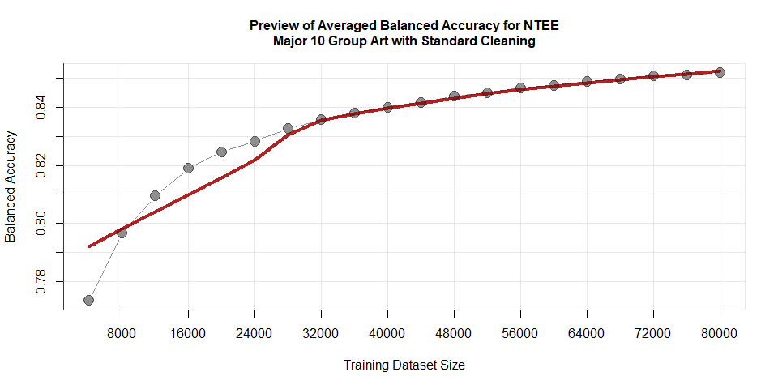
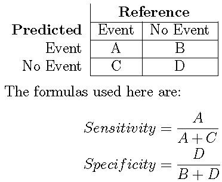
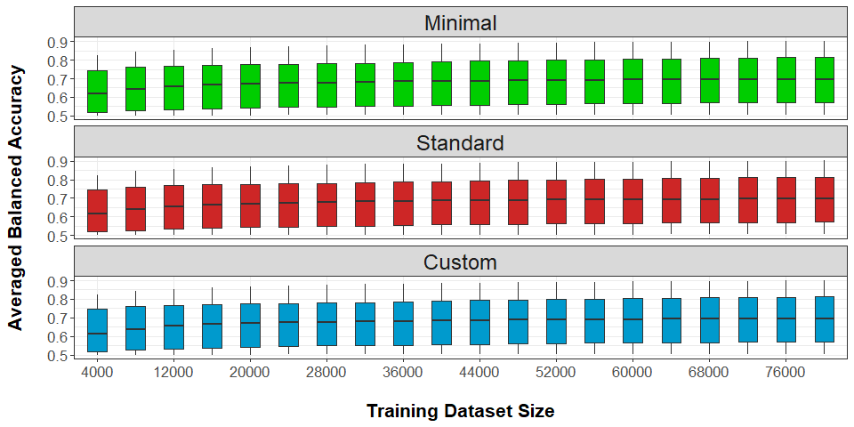
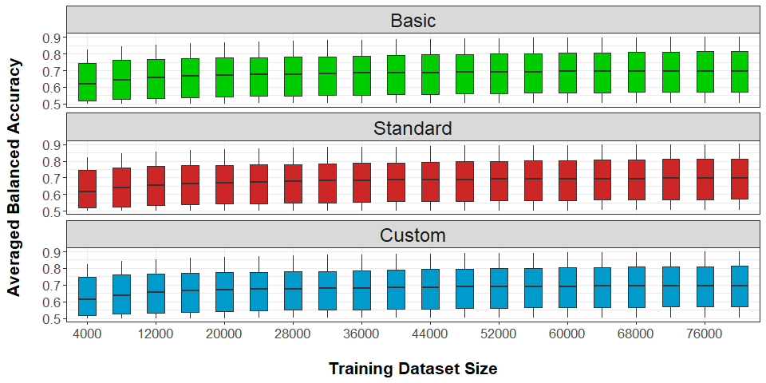

In this tutorial document, we will review the fifth step, analyzing the output files consisting of performance data for our bootstrapped classification of nonprofit mission statements. 

*Additional information on replication steps and data for this project can be found [on this GitHub page](https://fjsantam.github.io/bespoke-npo-taxonomies/)*

# Introduction

Now that we have [consolidated our various result output files into a single dataset](https://fjsantam.github.io/bespoke-npo-taxonomies/step-04-combine-bootstrap-output-files.html), we need to analyze the algorithm performance. 

Below are the libraries that we will use.


```{.r .fold-show}
library( dplyr ) # for data wrangling
library( DT ) # for datatables and interactive tables in rmarkdown
library( ggplot2 ) # for visualizations
library( scales ) # for visualizations
```

## Read in the data

If you have just completed step 4, then the necessary datasets are still in your active environment. If not, then read in the .Rdata file of consolidated results that we created. This file should be saved in a folder in your working directory called "FINAL".


```{.r .fold-show}
load( "FINAL/BOOTSTRAP-RESULTS.Rdata" )
```

We now have the three objects of performance data by cleaning method in our environment. What we do not have, however, is a single object that contains all of the data as well as indicating what the cleaning method is. We can create that object below.


```r
df.types <- c("Minimal", "Standard", "Custom")

df <- cbind( df.minimal, df.types[1] ) #bind a column for dataset to each row
colnames( df)[7] <- "dataset" #rename the dataset
df.holding <- cbind( df.standard, df.types[2] ) #repeat the earlier step with a temporary object
colnames( df.holding )[7] <- "dataset"
df <- rbind( df, df.holding ) #bind the temporary object onto the dataframe
df.holding <- cbind( df.custom, df.types[3] ) 
colnames( df.holding )[7] <- "dataset"
df <- rbind( df, df.holding )

rm(df.holding)
```

# Understanding the dataset

## Data dictionary

We include here the same data dictionary, or description of data in each column, that was presented in [Step 4](https://fjsantam.github.io/bespoke-npo-taxonomies/step-04-combine-bootstrap-output-files.html).

* **n.train** - Number of missions in the training dataset  
* **n.predict** - Number of missions used during predictions made with our trained Naive Bayes model    
* **n.predict.class** - Number of cases in the prediction class out of *n.predict* total cases  
* **prediction.class** - the binarized class that is being predicted 
* **metric.type** - different measures of model accuracy for Naive Bayes models 
* **metric.value** - observed value generated from that sample in the bootstrap
* **dataset** - added in Step 5; identifies the cleaning method and source dataset for the training data

## Dataset dimensions

To explore what our newly bound dataset consists of, we will preview its structure using the function `str()`.


```r
str( df ) #preview the structure
```

```
## 'data.frame':	2376000 obs. of  7 variables:
##  $ n.train         : int  4000 4000 4000 4000 4000 4000 4000 4000 4000 4000 ...
##  $ n.predict       : num  20000 20000 20000 20000 20000 20000 20000 20000 20000 20000 ...
##  $ n.predict.class : int  1009 1009 1009 1009 1009 1009 1009 1009 1009 1009 ...
##  $ prediction.class: chr  "Disasterreliefyes" "Disasterreliefyes" "Disasterreliefyes" "Disasterreliefyes" ...
##  $ metric.type     : chr  "Sensitivity" "Specificity" "Pos.Pred.Value" "Neg.Pred.Value" ...
##  $ metric.value    : num  0.9899 0.0436 0.9512 0.1864 0.9512 ...
##  $ dataset         : chr  "Minimal" "Minimal" "Minimal" "Minimal" ...
```

As we can see, the total number of observations is 2,376,000, or 792,000 (each dataframe) x 3. This number is the product of:

* **3** datasets
* **22** prediction classes (see [Step 4](https://fjsantam.github.io/bespoke-npo-taxonomies/step-04-combine-bootstrap-output-files.html) for more info)
* **20** increments in training dataset size (from 4,000 to 80,000 mission statements, in unit increases of 4,000)
* **100** bootstraps at each training dataset size for each combinaion of dataset and prediction class
* **18** metric types that we generated, or 18 labels for unique performance data points for each algorithm trained with each bootstrapped dataset

In other words, each observation in the dataset is a unique metric type for that bootstrapped algorithm at that training dataset size and prediction class-dataset combination.

## Removing NAs

One potential issue with this number is, how many rows consist of NAs or functionally blank values? Let's identify that number, then remove observations with NA for the metric value from our dataset. Missing values could be reported as "NA" or "NaN", so we want to remove rows with either.


```r
dim.old <- comma( nrow( df ) ) #number of rows before removing NAs
dim.NA <- comma( 
  length( df$metric.value[ 
    is.na( df$metric.value ) | 
      is.nan( df$metric.value ) ] 
    ) 
  ) #number of rows with missing values

# Replace either category of missing values with "NA"
df$metric.value[ is.na( df$metric.value ) | is.nan( df$metric.value ) ] <- NA

#Remove rows with missing values from the dataset
df <- na.omit( df )

dim.new <- comma( nrow( df ) )

naOutput <- data.frame( 
  rbind( dim.old, dim.NA, dim.new ), 
  row.names = c("Original number of rows", "Rows with missing values (NA or NaN)", "Rows without missing values")
)

colnames( naOutput ) <- ""

print( "Comparison of the original count of rows, rows with NAs, and  new count of rows " )
```

```
## [1] "Comparison of the original count of rows, rows with NAs, and  new count of rows "
```

```r
naOutput
```

<div data-pagedtable="false">
  <script data-pagedtable-source type="application/json">
{"columns":[{"label":[""],"name":["_rn_"],"type":[""],"align":["left"]},{"label":[""],"name":[1],"type":["chr"],"align":["left"]}],"data":[{"1":"2,376,000","_rn_":"Original number of rows"},{"1":"528,000","_rn_":"Rows with missing values (NA or NaN)"},{"1":"1,848,000","_rn_":"Rows without missing values"}],"options":{"columns":{"min":{},"max":[10]},"rows":{"min":[10],"max":[10]},"pages":{}}}
  </script>
</div>

It turns out that four of the metrics generated by `confusionMatrix()`, used in [Step 3](https://fjsantam.github.io/bespoke-npo-taxonomies/step-03-classification-bootstrapping.html), are consistently missing values. The first appearance of each of these metrics in the performance dataset for "minimal" cleaning is reported below.


```r
head( df.minimal[ is.na(df.minimal$metric.value), ], 4 )
```

<div data-pagedtable="false">
  <script data-pagedtable-source type="application/json">
{"columns":[{"label":[""],"name":["_rn_"],"type":[""],"align":["left"]},{"label":["n.train"],"name":[1],"type":["int"],"align":["right"]},{"label":["n.predict"],"name":[2],"type":["dbl"],"align":["right"]},{"label":["n.predict.class"],"name":[3],"type":["int"],"align":["right"]},{"label":["prediction.class"],"name":[4],"type":["chr"],"align":["left"]},{"label":["metric.type"],"name":[5],"type":["chr"],"align":["left"]},{"label":["metric.value"],"name":[6],"type":["dbl"],"align":["right"]}],"data":[{"1":"4000","2":"20000","3":"1009","4":"Disasterreliefyes","5":"AccuracyLower","6":"NA","_rn_":"AccuracyLower...14"},{"1":"4000","2":"20000","3":"1009","4":"Disasterreliefyes","5":"AccuracyUpper","6":"NA","_rn_":"AccuracyUpper...15"},{"1":"4000","2":"20000","3":"1009","4":"Disasterreliefyes","5":"AccuracyNull","6":"NA","_rn_":"AccuracyNull...16"},{"1":"4000","2":"20000","3":"1009","4":"Disasterreliefyes","5":"AccuracyPValue","6":"NA","_rn_":"AccuracyPValue...17"}],"options":{"columns":{"min":{},"max":[10]},"rows":{"min":[10],"max":[10]},"pages":{}}}
  </script>
</div>

## Summarizing performance

To make life easier for analysis, we will create another dataset that summarizes performance results, specifically, finding the averages of each metric by the training dataset size. We will need to transform the column "metric.type" to factors, and we will see what the levels are for that column in our new dataset.


```{.r .fold-show}
# Relevel metric type factor - convert from characters to factors
df$metric.type <- factor( df$metric.type )

# Find average of each metric by training data size
df.summary <- 
  df %>%
    group_by( n.train, prediction.class, metric.type, dataset  ) %>%
    summarize( value = mean( metric.value ), 
               min=min(metric.value), 
               max=max(metric.value),
               sd=sd(metric.value),
               class.prop=mean(n.predict.class/100) ) 

levels( df.summary$metric.type )
```

```
##  [1] "Accuracy"             "Balanced.Accuracy"    "Detection.Prevalence"
##  [4] "Detection.Rate"       "F1"                   "Kappa"               
##  [7] "McnemarPValue"        "Neg.Pred.Value"       "Pos.Pred.Value"      
## [10] "Precision"            "Prevalence"           "Recall"              
## [13] "Sensitivity"          "Specificity"
```

Quick explanation of the dataset's dimensions:


```r
dim(df.summary)
```

```
## [1] 18480     9
```

The performance summary dataset has 18,480 rows, which is the product of:

* **3** datasets
* **22** prediction classes (see [Step 4](https://fjsantam.github.io/bespoke-npo-taxonomies/step-04-combine-bootstrap-output-files.html) for more info)
* **20** increments in training dataset size (from 4,000 to 80,000 mission statements, in unit increases of 4,000)
* **14** different metric types

Each row in the performance summary dataset thus reports the key measures of center and spread of the distribution of values for each metric type for that training dataset for that prediction class-dataset combination. The distribution was generated from the bootstrapping procedure. 

To recap, this dataset reduces each distribution of bootstrap results to its key measures. We also have 4 less different metric types as a result of removing NAs.

Let's preview this performance summary dataset.


```r
head( as.data.frame(df.summary), 9 )
```

<div data-pagedtable="false">
  <script data-pagedtable-source type="application/json">
{"columns":[{"label":[""],"name":["_rn_"],"type":[""],"align":["left"]},{"label":["n.train"],"name":[1],"type":["int"],"align":["right"]},{"label":["prediction.class"],"name":[2],"type":["chr"],"align":["left"]},{"label":["metric.type"],"name":[3],"type":["fct"],"align":["left"]},{"label":["dataset"],"name":[4],"type":["chr"],"align":["left"]},{"label":["value"],"name":[5],"type":["dbl"],"align":["right"]},{"label":["min"],"name":[6],"type":["dbl"],"align":["right"]},{"label":["max"],"name":[7],"type":["dbl"],"align":["right"]},{"label":["sd"],"name":[8],"type":["dbl"],"align":["right"]},{"label":["class.prop"],"name":[9],"type":["dbl"],"align":["right"]}],"data":[{"1":"4000","2":"Disasterreliefyes","3":"Accuracy","4":"Custom","5":"0.9449055","6":"0.9407000","7":"0.9499000","8":"0.001644364","9":"10.0519","_rn_":"1"},{"1":"4000","2":"Disasterreliefyes","3":"Accuracy","4":"Minimal","5":"0.9437175","6":"0.9381000","7":"0.9478000","8":"0.002000888","9":"10.0713","_rn_":"2"},{"1":"4000","2":"Disasterreliefyes","3":"Accuracy","4":"Standard","5":"0.9440350","6":"0.9389500","7":"0.9479500","8":"0.001702457","9":"10.0262","_rn_":"3"},{"1":"4000","2":"Disasterreliefyes","3":"Balanced.Accuracy","4":"Custom","5":"0.5131818","6":"0.5024809","7":"0.5245187","8":"0.004468799","9":"10.0519","_rn_":"4"},{"1":"4000","2":"Disasterreliefyes","3":"Balanced.Accuracy","4":"Minimal","5":"0.5149043","6":"0.5074819","7":"0.5286372","8":"0.003986872","9":"10.0713","_rn_":"5"},{"1":"4000","2":"Disasterreliefyes","3":"Balanced.Accuracy","4":"Standard","5":"0.5143624","6":"0.5042669","7":"0.5235006","8":"0.004629857","9":"10.0262","_rn_":"6"},{"1":"4000","2":"Disasterreliefyes","3":"Detection.Prevalence","4":"Custom","5":"0.9918320","6":"0.9873500","7":"0.9946500","8":"0.001638605","9":"10.0519","_rn_":"7"},{"1":"4000","2":"Disasterreliefyes","3":"Detection.Prevalence","4":"Minimal","5":"0.9902400","6":"0.9837500","7":"0.9934000","8":"0.001719188","9":"10.0713","_rn_":"8"},{"1":"4000","2":"Disasterreliefyes","3":"Detection.Prevalence","4":"Standard","5":"0.9904820","6":"0.9864500","7":"0.9939500","8":"0.001646661","9":"10.0262","_rn_":"9"}],"options":{"columns":{"min":{},"max":[10]},"rows":{"min":[10],"max":[10]},"pages":{}}}
  </script>
</div>

Let's go ahead and export the dataset, so we can read it in later without having to repeat the previous steps.


```{.r .fold-show}
write.csv( x = df.summary,
           file = "summary_BOOTSTRAP-RESULTS.csv",
           col.names = TRUE )
```


### Preview: Balanced Accuracy

To demonstrate what output will look like, let's subset the data by prediction class of NTEE Major 10 Group, Art, our desired metric type of balanced accuracy, and the "standard" cleaning method. This time, let's just preview the first 6 lines to see how they vary.


```{.r .fold-show}
df.demo <- 
  df.summary %>% 
  filter( prediction.class=="ntmaj10art" & metric.type=="Balanced.Accuracy" & dataset=="Standard") 

head( as.data.frame(df.demo), 6 )
```

<div data-pagedtable="false">
  <script data-pagedtable-source type="application/json">
{"columns":[{"label":[""],"name":["_rn_"],"type":[""],"align":["left"]},{"label":["n.train"],"name":[1],"type":["int"],"align":["right"]},{"label":["prediction.class"],"name":[2],"type":["chr"],"align":["left"]},{"label":["metric.type"],"name":[3],"type":["fct"],"align":["left"]},{"label":["dataset"],"name":[4],"type":["chr"],"align":["left"]},{"label":["value"],"name":[5],"type":["dbl"],"align":["right"]},{"label":["min"],"name":[6],"type":["dbl"],"align":["right"]},{"label":["max"],"name":[7],"type":["dbl"],"align":["right"]},{"label":["sd"],"name":[8],"type":["dbl"],"align":["right"]},{"label":["class.prop"],"name":[9],"type":["dbl"],"align":["right"]}],"data":[{"1":"4000","2":"ntmaj10art","3":"Balanced.Accuracy","4":"Standard","5":"0.7735934","6":"0.7495777","7":"0.7918398","8":"0.007966117","9":"20.2359","_rn_":"1"},{"1":"8000","2":"ntmaj10art","3":"Balanced.Accuracy","4":"Standard","5":"0.7966627","6":"0.7816601","7":"0.8091904","8":"0.006255130","9":"20.3246","_rn_":"2"},{"1":"12000","2":"ntmaj10art","3":"Balanced.Accuracy","4":"Standard","5":"0.8094444","6":"0.7946663","7":"0.8215278","8":"0.005480057","9":"20.3345","_rn_":"3"},{"1":"16000","2":"ntmaj10art","3":"Balanced.Accuracy","4":"Standard","5":"0.8189102","6":"0.8069951","7":"0.8320449","8":"0.005419293","9":"20.3188","_rn_":"4"},{"1":"20000","2":"ntmaj10art","3":"Balanced.Accuracy","4":"Standard","5":"0.8246480","6":"0.8112991","7":"0.8356901","8":"0.004996890","9":"20.3043","_rn_":"5"},{"1":"24000","2":"ntmaj10art","3":"Balanced.Accuracy","4":"Standard","5":"0.8283360","6":"0.8159548","7":"0.8400729","8":"0.004954431","9":"20.3028","_rn_":"6"}],"options":{"columns":{"min":{},"max":[10]},"rows":{"min":[10],"max":[10]},"pages":{}}}
  </script>
</div>

A simple graphic comparing balanced accuracy and training dataset size follows, which includes a non-parametric smoothing function to show a trend line (in red).


```r
x <- df.demo$n.train
y <- df.demo$value
plot( x, y, type="b",  bty="n", xaxt="n", yaxt="n",
      pch=19, col=gray( 0.0,0.25), cex=1.8,
      xlab="Training Dataset Size", ylab="Balanced Accuracy",
      main = "Preview of Averaged Balanced Accuracy for NTEE\nMajor 10 Group Art with Standard Cleaning",
      cex.main = 1)
axis( side = 2, at = seq(0.01, 1.00, 0.01) )
axis( side = 1, at= seq(0,max(df.demo$n.train),max(df.demo$n.train)/10) )
abline( h=seq(0.01, 1.00, 0.01), lwd=0.5, col=gray(0.7,0.3) )
abline( v=seq(0,max(df.demo$n.train),max(df.demo$n.train)/10), lwd=0.5, col=gray(0.7,0.3) )
lines( lowess(x,y), col="firebrick", lty=1, lwd=4 )
box( col=gray(0.7,0.3) )
points( x, y, type="b", pch=19, col=gray( 0.0,0.25), cex=1.8 )
```

<!-- -->

### Parsing out Prediction Classes

Later in our analysis, we will generate data broken out by prediction class. To assist with that, we will create objects dedicated to the NTEE Major 10 groups, the tax-exempt purpose codes, and the additional classes that we have data on. We will do the same thing for the majority of metrics we may want to investigate. **Remember** that in this tutorial, we will only be analyzing balanced accuracy.


```{.r .fold-show}
classes <- unique( df$prediction.class )

classes.1 <- classes[ c(1:2, 13, 14) ]
classes.nt <- classes[3:12]
classes.te <- classes[15:22]

metrics <- c("Accuracy", "Balanced.Accuracy", "Detection.Prevalence", 
  "Detection.Rate", "F1", "Kappa", "Neg.Pred.Value", 
  "Pos.Pred.Value", "Precision", "Prevalence", 
  "Sensitivity", "Specificity")
```

# Analyzing the results

As discussed in the main publication associated with this tutorial, we will be looking at the performance metric of balanced accuracy because of how it compensates for imbalances in the training sets, i.e., when the training and testing datasets have different numbers of observed prediction classes. For more information, please refer to the `caret` package's [help documentation around measuring performance](https://topepo.github.io/caret/measuring-performance.html) and [Brodersen et al.'s (2010) article on balanced accuracy](http://www.ong-home.my/papers/brodersen10post-balacc.pdf)

## Balanced Accuracy

### Definition

Our performance metric of interest is balanced accuracy, the calculation for which can be summarized as

> Balanced Accuracy = (Sensitivity + Specificity) / 2

Where 

* **Sensitivity** refers to the ratio of classes predicted to be true that actually were true (true positive) to the ratio of all classes that actually were true, both predicted to be true (true positive) or predicted to be false (false negative).
* **Specificity** refers to the ratio of classes predicted to be false that actually were false (true negative) to the ratio of all classes that actually were true, both predicted to be true (false positive) or predicted to be false (true negative).

The `caret` package's [help documentation](https://topepo.github.io/caret/measuring-performance.html) uses a grid to communicate this information:

{width=35%}

For people who prefer different forms of visual learning, [Wikpedia's article on sensitivity and specificity](https://en.wikipedia.org/wiki/Sensitivity_and_specificity) has a helpful graphic on this:

{width=60%}

### Filter the data 

We will only be analyzing balanced accuracy moving forward so we can remove the rest of the metric types from our summary dataset, as seen in the preview output below.


```{.r .fold-show}
df.summary <- 
  df.summary %>% 
  filter( metric.type=="Balanced.Accuracy" ) 

head( as.data.frame(df.demo), 6 )
```

<div data-pagedtable="false">
  <script data-pagedtable-source type="application/json">
{"columns":[{"label":[""],"name":["_rn_"],"type":[""],"align":["left"]},{"label":["n.train"],"name":[1],"type":["int"],"align":["right"]},{"label":["prediction.class"],"name":[2],"type":["chr"],"align":["left"]},{"label":["metric.type"],"name":[3],"type":["fct"],"align":["left"]},{"label":["dataset"],"name":[4],"type":["chr"],"align":["left"]},{"label":["value"],"name":[5],"type":["dbl"],"align":["right"]},{"label":["min"],"name":[6],"type":["dbl"],"align":["right"]},{"label":["max"],"name":[7],"type":["dbl"],"align":["right"]},{"label":["sd"],"name":[8],"type":["dbl"],"align":["right"]},{"label":["class.prop"],"name":[9],"type":["dbl"],"align":["right"]}],"data":[{"1":"4000","2":"ntmaj10art","3":"Balanced.Accuracy","4":"Standard","5":"0.7735934","6":"0.7495777","7":"0.7918398","8":"0.007966117","9":"20.2359","_rn_":"1"},{"1":"8000","2":"ntmaj10art","3":"Balanced.Accuracy","4":"Standard","5":"0.7966627","6":"0.7816601","7":"0.8091904","8":"0.006255130","9":"20.3246","_rn_":"2"},{"1":"12000","2":"ntmaj10art","3":"Balanced.Accuracy","4":"Standard","5":"0.8094444","6":"0.7946663","7":"0.8215278","8":"0.005480057","9":"20.3345","_rn_":"3"},{"1":"16000","2":"ntmaj10art","3":"Balanced.Accuracy","4":"Standard","5":"0.8189102","6":"0.8069951","7":"0.8320449","8":"0.005419293","9":"20.3188","_rn_":"4"},{"1":"20000","2":"ntmaj10art","3":"Balanced.Accuracy","4":"Standard","5":"0.8246480","6":"0.8112991","7":"0.8356901","8":"0.004996890","9":"20.3043","_rn_":"5"},{"1":"24000","2":"ntmaj10art","3":"Balanced.Accuracy","4":"Standard","5":"0.8283360","6":"0.8159548","7":"0.8400729","8":"0.004954431","9":"20.3028","_rn_":"6"}],"options":{"columns":{"min":{},"max":[10]},"rows":{"min":[10],"max":[10]},"pages":{}}}
  </script>
</div>

This version of the summary dataset should have 1,320 rows, or 1/14^th^ of the rows in the summary dataset that we created earlier. We can confirm that with the following script. 


```{.r .fold-show}
dim(df.summary)
```

```
## [1] 1320    9
```

To assist with future coding efforts, let's go ahead and export this dataset to our working directory.


```{.r .fold-show}
write.csv( x = df.summary,
           file = "summary_Bal-Accuracy_BOOTSTRAP-RESULTS.csv",
           col.names = TRUE )
```


## Box and Whisker Plots for distributions

Box and whisker plots allow us to visualize distributions of continuous variables for easy, side-by-side comparisons. We can visually explore the distributions for balanced accuracy at each training dataset size by adapting some of the guidance code provided in the [R Graph Gallery](https://www.r-graph-gallery.com/265-grouped-boxplot-with-ggplot2.html).

Given the importance of exploring how the size of the training dataset affects balanced accuracy, we will break out the three cleaning methods vertically. 


```r
#Convert training dataset sizes to factor values
# Minimal = green "green3"
# Standard = red "firebrick3"
# Custom = blue "deepskyblue3"
x.val <- as.factor( df.summary$n.train )
df.summary$dataset_groups <- factor(df.summary$dataset,
                             levels = c("Minimal", "Standard", "Custom" ) )

boxplots.balAcc <- ggplot(df.summary, aes(x=x.val, y=value, fill=dataset, order = dataset)) +
    geom_boxplot( show.legend = F, width = 0.5 ) +
    facet_wrap(facets = ~dataset_groups, 
               dir = "v") +
    scale_fill_manual( values = setNames(
      c( "green3", "firebrick3", "deepskyblue3" ),
      levels(df.summary$dataset_groups) ) ) + 
    theme_bw( ) + 
    theme( axis.text = element_text( size = 13 ),
           axis.title = element_text( size = 16, face = "bold" ),
           strip.text = element_text(size = 18) ) +
  scale_x_discrete( breaks = unique(x.val)[seq(1, length(unique(x.val)), by = 2)] )

print( boxplots.balAcc + labs( y = "Averaged Balanced Accuracy\n", x = "\nTraining Dataset Size" ) )
```

<!-- -->


Replace "Minimal" with "Basic" in the entire dataset


```r
df.summary2 <- df.summary
df.summary2$dataset <- gsub("Minimal", "Basic", df.summary2$dataset)

#Convert training dataset sizes to factor values
# Minimal = green "green3"
# Standard = red "firebrick3"
# Custom = blue "deepskyblue3"
x.val <- as.factor( df.summary2$n.train )
df.summary2$dataset_groups <- factor(df.summary2$dataset,
                             levels = c("Basic", "Standard", "Custom" ) )

boxplots.balAcc2 <- ggplot(df.summary2, aes(x=x.val, y=value, fill=dataset, order = dataset)) +
    geom_boxplot( show.legend = F, width = 0.5 ) +
    facet_wrap(facets = ~dataset_groups, 
               dir = "v") +
    scale_fill_manual( values = setNames(
      c( "green3", "firebrick3", "deepskyblue3" ),
      levels(df.summary2$dataset_groups) ) ) + 
    theme_bw( ) + 
    theme( axis.text = element_text( size = 13 ),
           axis.title = element_text( size = 16, face = "bold" ),
           strip.text = element_text(size = 18) ) +
  scale_x_discrete( breaks = unique(x.val)[seq(1, length(unique(x.val)), by = 2)] )

print( boxplots.balAcc2 + labs( y = "Averaged Balanced Accuracy\n", x = "\nTraining Dataset Size" ) )
```

<!-- -->

## Derivatives

### Maximum values

We can identify peak balanced accuracy gains in our dataset by leveraging functionality in the `dplyr` package of the [`tidyverse` suite](https://www.tidyverse.org/) of data science-focused R packages.


```{.r .fold-show}
#replace ___ with the variable containing derivative info
#may need to create unique dataset for derivatives

df.summary.minimal <- 
  df.summary %>% 
  filter( dataset=="Minimal" ) %>%
  group_by( prediction.class ) %>%
  slice( which.max( ___ ) ) #replace this with the variable containing derivative info
  
df.summary.standard <- 
  df.summary %>% 
   filter( dataset=="Standard" ) %>%
  group_by( prediction.class ) %>%
  slice( which.max( ___ ) ) 

df.summary.custom <- 
  df.summary %>% 
  filter( dataset=="Custom" ) %>%
  group_by( prediction.class ) %>%
  slice( which.max( ___ ) ) 
```

### Dot Plot

http://r-statistics.co/Top50-Ggplot2-Visualizations-MasterList-R-Code.html#Dot%20Plot


#### Tax-exempt purpose codes


#### NTEE Major 10 Groups
